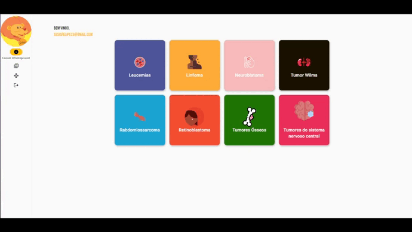

# gameici

Educational Support Platform for health and education professionals, with the aim of helping with knowledge about early diagnosis of cancer in children and adolescents.

# Screens

   

# Developed by the partnership

